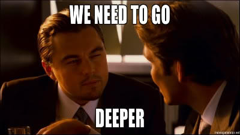

Event Email
===========

Practical information when setting up the event:


Besten,

Morgen [__donderdag 9/3__] is het virtuele event React Component Profiling om [__19u30__].

We gaan technisch vrij diep maar het blijft luchtig met pptx, demos
**en vooral veel memes, dus als je twijfelde... It's gonna be awesome!**


## Installatie

```sh
git clone --recurse-submodules --remote-submodules https://github.com/itenium-be/React-ComponentProfiling
cd React-ComponentProfiling/confac
git checkout profiling-0-start
npm install
```
(heeft sub folder /confac/ met de applicatie zelf)

Als je actief mee wil volgen:

- [Download Chrome Extension](https://chrome.google.com/webstore/detail/react-developer-tools/fmkadmapgofadopljbjfkapdkoienihi?hl=en)
- Een [confac backend](https://github.com/itenium-be/confac) moet draaiend zijn (zie README in de repo) 


## Er is veel materiaal

Er is ongeveer 2u nodig tot en met "Part 2" het grootste (en natuurlijk meest interessante) performantie probleem.

Er zijn drie delen:
- Part 1 : Easy Pickings
- Part 2 : The Meaty Part
- Part 3 : Going Beyond


Na elk deel is er een kleine pauze en kan je eventueel afhaken als je het gehad hebt 😃  
Ik zal na elk Part ook even afstemmen of we sneller beginnen gaan (vb enkel de pptx of kortere demos,
de profiler niet meer gebruiken maar enkel profiler screenshots analyseren, ...)


## Voor de blijvers



 
Tot dan!!
